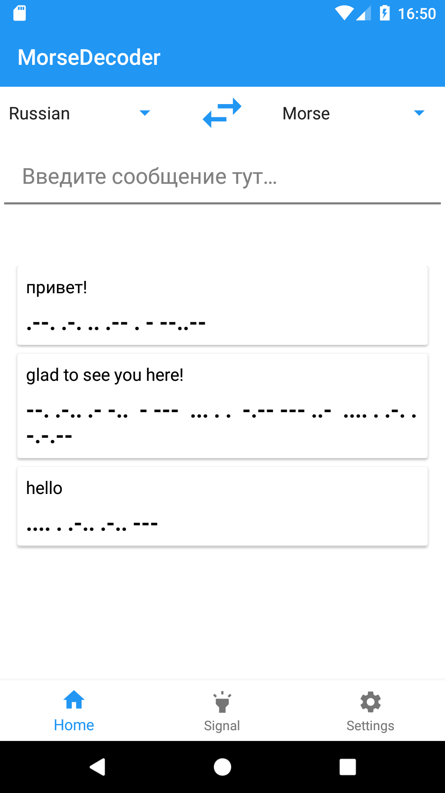
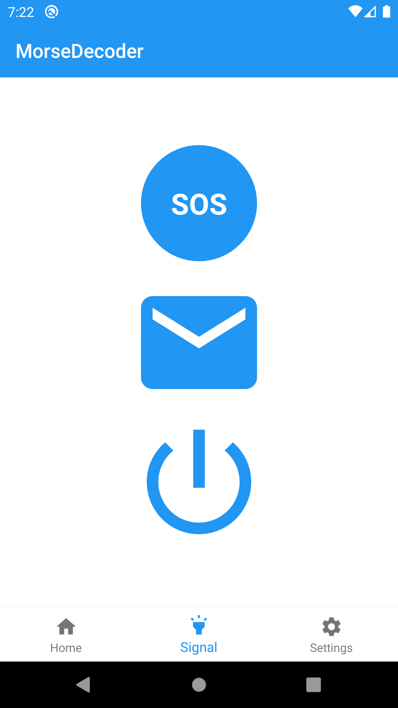
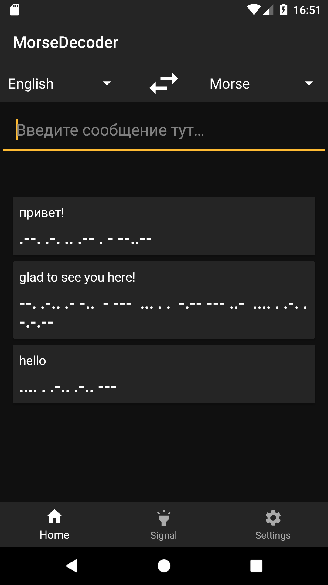
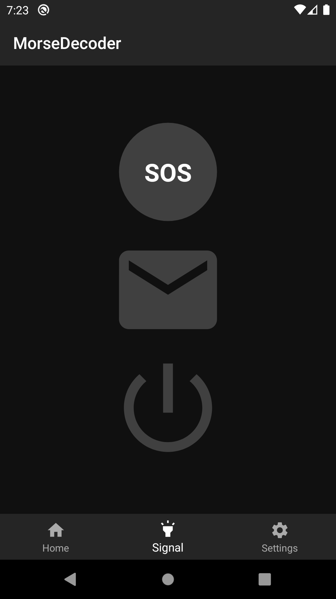

# MorseDecoder
MorseDecoder is an open-source app for Android(5.0 or newer). The code is under Apache License 2.0.

## Description
This application allows you to translate English or Russian language into Morse code and Morse code to your language.
Also you can send signals with flashlight and share your translations through another messager.
MorseDecoder has a simple UI that makes it easy to use. Application provides two themes light and dark.

&nbsp;&nbsp;&nbsp;&nbsp;&nbsp;&nbsp;

&nbsp;&nbsp;&nbsp;&nbsp;&nbsp;&nbsp;

## Credits

* Application icon made by Smashicons from www.flaticon.com

